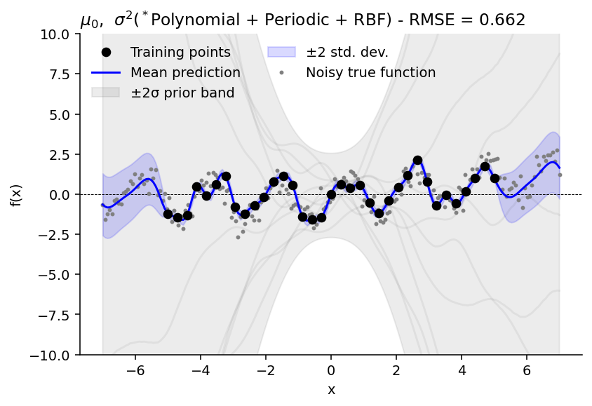

# Exploring Gaussian Processes with NumPy and GPyTorch

All of these experimenst focussed on a single target (y) and single feature (X).

For a great intro to Gaussian Processes (GPs), see the [GPJax primer](https://docs.jaxgaussianprocesses.com/_examples/intro_to_gps/).

## Basic GP regression in NumPy

Here, I had a look at the intuition of GPs on a basic linear regression problem. I explored the idea of a constant vs linear mean function, while using the squared exponential covariance (RBF).

In most cases, we'll want to use a constant mean function, meaning that any linear trend becomes part of the covariance function, and we can use the GP to predict the mean and variance of the target variable at new points. However, if we know that the data has a linear trend, we can use a linear mean function to help the GP learn this trend more effectively. Our prior will then have a linear element, rather than being a constant. One such example, would be $\Delta f\text{CO}_2 = f\text{CO}_2^{\text{T}_0} e^{0.0433(T_1 - T_0)}$, where we could apply such a correction to seasonal changes in $f\text{CO}_2$ (though, probably more tricky that simply doing that).
The code for this is in [basic_gp_numpy.ipynb](./basic_gp_numpy.ipynb).

<div class="figure">


</div>

Though, in almost every case, we'd want to use a constant mean function, as it allows the GP to learn the trend in the data more effectively. The linear mean function is useful for understanding the intuition behind GPs, but in practice, we would typically use a constant mean function.

### Theory session

We can break a GP problem into a mean and a variance component, shown by:
$$f(x) \sim \mathcal{GP}(\mu(x), \sigma^2(x))$$

where $\mu(x)$ is the mean function and $\sigma^2(x)$ is the variance function.

To estimate the mean, we use the formula:
$$\mu_s = K_*^T K^{-1} y$$
where $K_*$ is the covariance between the training points and the test points, $K$ is the covariance matrix of the training points, and $y$ is the target variable. To gain a bit of an intuition about this, we can perform the operation $y = K^T K^{-1} y$, where $K^T K^{-1}$ is an identity matrix. This is because the kernel-space distances between the training points is exact, hence we end up with the same values as $y$. Now, if we do this with $K_*^T$ instead of $K^T$, we get a representation of how far the training and test samples are from each other in the feature space (i.e., covaraince matrix). Multiplying by $y$ gives an estimate of the mean of the test points based on the training points.

To estimate the variance, we use the formula:
$$\sigma_s^2 = \operatorname{diag}(K_{**} - K_*^T K^{-1} K_*)$$
where $K_{**}$ is the covariance of the test points with themselves. This is the genius of GPs - estimating the uncertainty based on the given training data. I don't completely understand this yet, but we can think of it as a measure of the distance of the test points from the training points in the feature space.

Now that we have $\mu_s$ and $\sigma_s^2$, we can sample from the GP to get a distribution of possible values for the test points. We can do this before we've seen the training data (the prior) and then after we've seen the training data (the posterior).


## Basic GP regression in GPyTorch
To demonstrate this, I tested this in GPyTorch, using the same data and a similar model. The code for this is in [basic_gpytorch.ipynb](./basic_gpytorch.ipynb).

<div class="figure">


</div>
The results are similar to the NumPy implementation, with the constant mean function performing better than the linear mean function giving us a better idea of the uncertainty in the linear trend of the data if we do not know that there is a linear relationship. On the other hand, in this case, the linear mean is not initialised with a known slope and intercept, so we see that the prior is not very informative.

<div style='font-weight:bold; padding:6px 15px; margin:10px 0px; background: #a2e8b5; border-radius: 10px;'>
NOTE: if we don't know if there is a mean trend, we should use a constant mean function + linear kernel (if applicable). </div>


## Nonlinear GP regression in GPyTorch
Here, I explore mostly the impact of kernel selection.

Here are some results. All of these are with a noise prior of $\mathcal{N}(0, 1)$. The RMSE in each case shows the test score, i.e., residual of grey dots and blue line. In this case, we can see that the Polynomial kernel (power=2) + the Periodic kernel (learnt lengthscale) performs the best, despite training RMSE on RBF-including being better. The good thing is that the uncertainties of the posterior actually capture this quite well.

A useful thing would be a package that automatically selects the best kernel based on the training data.

<div class="figure">


</br>

</div>

#### Importance of scaling each kernel independently

<div style="width:100%; float:left">
<div style="width:50%; float:left">
</div>

<div style="width:50%; float:left">
In GPyTorch, there is the option to scale each kernel independently. Failing to do so can lead to reduced performance, as the kernels can interfere with each other. Further, one can then also determine the contribution of each kernel to the overall model.

Based on the outputs from the experiments where the kernels were not scaled independently, we see that the variance of the posterior is much lower than the models with independent scaling.

<div style='font-weight:bold; padding:6px 16px; margin: 15px 0px; background: #e6d291; border-radius: 10px;'>
QUESTION: Why does scaling kernels together reduce the variance of the posterior?</div>
</div>
</div>


## Useful code snippets
For more useful code snippets, see the [tools.py](./tools.py) file.
#### Sampling from the prior
Sampling from the prior is enabled with the `gpytorch.settings.prior_mode(True)` context manager. This allows us to sample from the prior distribution of the model without having to train it first.
```python
n_samples = 10
model.eval()

with torch.no_grad(), gpytorch.settings.prior_mode(True):
    distribution = model(X_test)
    mu = distribution.mean
    std = distribution.variance.sqrt()
    samples = distribution.sample(n_samples)
```

#### Training
Getting the learning rate correct for the optimizer is crucial for training the model effectively. A too-low learning rate can fall into local minima, while a too-high learning rate can lead to divergence. A good starting point is often around 0.1, but this can vary based on the specific problem and data. The example below does not include early stopping.
```python
model.train()
likelihood.train()

# stick to Adam - probably the best but Alessandro used something else apparently
optimizer = torch.optim.Adam(model.parameters(), lr=0.5)

# for the ExactGP, we use the ExactMarginalLogLikelihood
mll = gpytorch.mlls.ExactMarginalLogLikelihood(likelihood, model)

for i in range(n_iters):
    optimizer.zero_grad()
    output = model(X_train)
    loss = -mll(output, y_train)
    loss.backward()
    optimizer.step()
```

#### Prediction
For prediction, don't forget to set the model and likelihood to evaluation mode.
```python
model.eval()
likelihood.eval()

with torch.no_grad(), gpytorch.settings.fast_pred_var():
    distribution = likelihood(model(X))
    mu = distribution.mean
    sigma = distribution.variance.sqrt()
```
