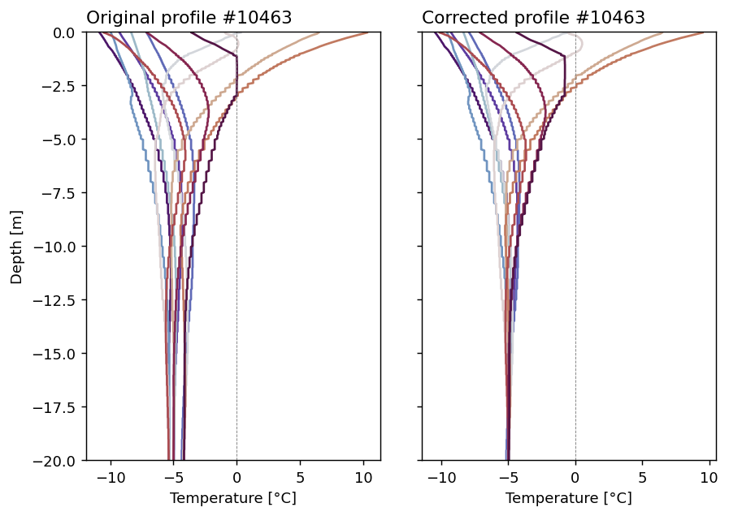

# Model Selection

In this section, I try to implement what I learnt in [1_learning_about_GPs](../1_learning_about_GPs/README.md) to the data I have.

- [x] Address issue of permafrost temperature having positive values (or often near 0). *Solution: focus on temperature at different depths - issue: may not represent ALT accurately since mean temperature < 0 can still have positive values at some points.*
- [x] Select an appropriate target transformation if applicable (-log, etc.). *Solution: predict a contiuous variable (ground temperature)*
- [ ] Kernel selection using the following criteria
  - [ ] Assess product vs additive kernels for the categorical features (which uses IndexKernel)
  - [x] Explore adding PolynomialKernel for features where there is likely a linear-like relationship (e.g., temperature, elevation). Solution: only elevation as linear.
  - [ ] The RBF kernel for the rest

## Notebooks

### [0_choosing_target_variable.ipynb](./0_choosing_target_variable.ipynb)

The first thing we have to do is re-assess the target variable (permafrost temperature), since it seems that there are many points that are shown as being permafrost, but are actually not (mean ground temperatures at all levels are > 0).

<b>UPDATE:</b> Looking at the data again, there doesn't seem much sense in predicting permafrost temperature, since it is not a continuous variable, which adds complexity. Thus predicting ground temperature at 2, 5, 10 m may be a better option for now.

<i>IDEA:</i> Predicting seasonal ground temperatures instead of annual mean. Choose coldest period and warmest period.

### [1_profile_prep.ipynb](./1_profile_prep.ipynb)
In this notebook, I prepare the temperature profiles for training (see green box above). Idea is to predict seasonal temperatures. For each season, I've computed the 10th, 50th and 90th quantiles of the temperature profiles. But the problem is that over 20 years, some profiles have changed. So, here we reference the profiles using the deepest meter (19-20 m) for the 50th percentile - assuming that this is the most representative of the long-term mean. We then adjust the other quantiles to this reference.

Below is an example of what this shift looks like for profile 10463.

Our goal will be to predict temperature at [1, 2, 3, 5, 7, 10, 15] m for selected profiles from each season. E.g., 90th quantile in summer, 10th quantile in winter, 50th quantile in autumn and spring, etc.
